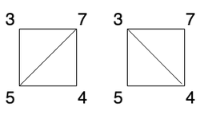
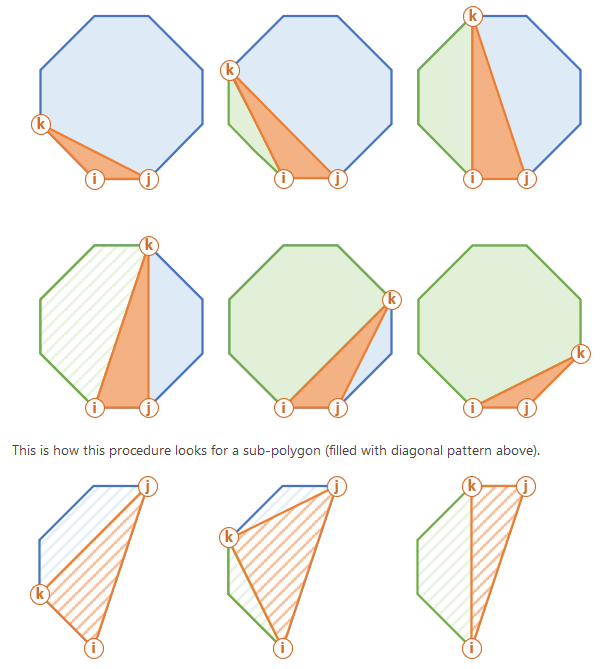

#### Minimum Score Triangulation of Polygon

> Given `N`, consider a convex `N`-sided polygon with vertices labelled `A[0], A[i], ..., A[N-1]` in clockwise order.
>
> Suppose you triangulate the polygon into `N-2` triangles.  For each triangle, the value of that triangle is the product of the labels of the vertices, and the total score of the triangulation is the sum of these values over all `N-2` triangles in the triangulation.
>
> Return the smallest possible total score that you can achieve with some triangulation of the polygon.
>
> Example 1:
> ```
> Input: [1,2,3]
> Output: 6
> Explanation: The polygon is already triangulated, and the score of the only triangle is 6.
> ```
> Example 2:
> 
> 
> ```
> Input: [3,7,4,5]
> Output: 144
> Explanation: There are two triangulations, with possible scores: 3*7*5 + > 4*5*7 = 245, or 3*4*5 + 3*4*7 = 144.  The minimum score is 144.
> ```
> 
> Example 3:
> ```
> Input: [1,3,1,4,1,5]
> Output: 13
> Explanation: The minimum score triangulation has score 1*1*3 + 1*1*4 + 1*1*5 + 1*1*1 = 13.
> ```

##### Solution

It is helpful to refer to the below picture:



The problem is asking us to minimize the cost of triangulating. Once we pick 3 points, we essentially cut the array into two parts, with the triangle as the divider.

The first milestone in solving this problem is realizing that we can do this recursively. Since the points form a polygon, the first and last point must be connected to one another. Furthermore, those edge between those two points must be part of exactly one triangle. Thus, we can try all the other points between those two as the possible third point of the triangle.

The recursive relationship is built upon the length of the array. For each each call, we split the array into two parts, until a subarray has less then 3 elements, since no triangle can be constructed from that subarray. Below is a simple recursive solution:

```py
def minScoreTriangulation(A):
    def dfs(left, right):
        if right - left + 1 < 3:
            return 0
        minnum = float("Inf")
        for k in range(left+1, right):
            minnum = min(minnum, A[left]*A[right]*A[k] + dfs(left, k) + dfs(k, right))
        return minnum
    return dfs(0, len(A) - 1)
```

There are lot of repeating subproblems in the above approach, so we use dynamic programming to avoid redoing work. 

The top down solution is the easiest, since we only need a memo to remember eachg combination of `(left, right)`. This takes $\small \mathcal O(n^{2})$ space, which is also what our running time becomes. 

To do this bottom up, we need to build a 2D array and populate the upper half of it with index boundaries. We begin by building up from our base case, which is an array of length `3`.