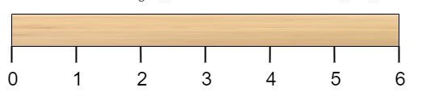
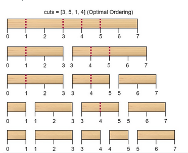

#### Minimum Cost to Cut a Stick

>Given a wooden stick of length n units. The stick is labeled from >0 to n. For example, a stick of length 6 is labeled as follows:
>
> 
> 
>Given an integer array cuts where cuts[i] denotes a position you >should perform a cut at.
>
>You should perform the cuts in order, you can change the order of >the cuts as you wish.
>
>The cost of one cut is the length of the stick to be cut, the >total cost is the sum of costs of all cuts. When you cut a stick, >it will be split into two smaller sticks (i.e. the sum of their >lengths is the length of the stick before the cut). Please refer >to the first example for a better explanation.
>
>Return the minimum total cost of the cuts.
>
> 
>
>Example 1:
>
> 
> 
>```
>Input: n = 7, cuts = [1,3,4,5]
>Output: 16
>Explanation: Using cuts order = [1, 3, 4, 5] as in the input leads to the following scenario:
>
>The first cut is done to a rod of length 7 so the cost is 7. The second cut is done to a rod of length 6 (i.e. the second part of the first cut), the third is done to a rod of length 4 and the last cut is to a rod of length 3. The total cost is 7 + 6 + 4 + 3 = 20.
>Rearranging the cuts to be [3, 5, 1, 4] for example will lead to a scenario with total cost = 16 (as shown in the example photo 7 + 4 + 3 + 2 = 16).
>```
>Example 2:
>```
>Input: n = 9, cuts = [5,6,1,4,2]
>Output: 22
>Explanation: If you try the given cuts ordering the cost will be 25.
>There are much ordering with total cost <= 25, for example, the order [4, 6, 5, 2, 1] has total cost = 22 which is the minimum possible.
>```
> 
>
>Constraints:
> ```
>    2 <= n <= 10^6
>    1 <= cuts.length <= min(n - 1, 100)
>    1 <= cuts[i] <= n - 1
>    All the integers in cuts array are distinct.
> ```

The brute force solution would be try every single possible permutation of the cuts and see which permutation has the smallest cost. Simply generating the permutations would take $O(n!)$ time, so this isn't really feasible. 

This is a dynamic programming problem, and the difficulty lies in figuring out the transition. Let `dp[i][j]` represent the minimum cost to cut the stick from `cuts[i]` to `cuts[j]`. The relationships are as such:

```py
# We can't cut this stick - base case
if j == i+1:    
    dp[i][j] = 0

# There is only one possible cut in the middle
if j == i+2:    
    dp[i][j] = cuts[j] - cuts[i]

# Multiple cuts - need to find the minimum cost
if j > i+2:
    for k in range(i+1, j):
        dp[i][j] = min(dp[i][k] + dp[k][j] + cuts[j] - cuts[i] | i < k < j)
```


The trick to making this problem cleaner is to insert `0` and `n` into `cuts` and then sort it. This gives us a nice boundary.

```py
def minCost(n: int, cuts: List[int]) -> int:
    cuts += [0, n]
    cuts.sort()
    
    dp = [[0] * len(cuts) for _ in range(len(cuts))]
    
    def helper(i, j):
        if j <= i+1:
            return 0
        elif j == i+2:
            dp[i][j] = cuts[j] - cuts[i]
        else:
            if not dp[i][j]:
                dp[i][j] = min(helper(i, k) + helper(k, j) + cuts[j] - cuts[i] for k in range(i+1, j))
        return dp[i][j]

    helper(0, len(cuts) - 1)
    return dp[0][-1]
```
