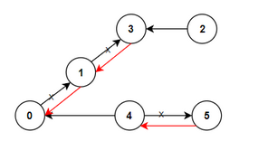
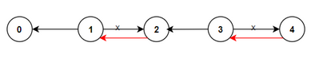

### Reorder Routes to Make All Paths Lead to the City Zero

>There are n cities numbered from 0 to n-1 and n-1 roads such that >there is only one way to travel between two different cities (this >network form a tree). Last year, The ministry of transport decided >to orient the roads in one direction because they are too narrow.
>Roads are represented by connections where connections[i] = [a, b] represents a road from city a to b.
>
>This year, there will be a big event in the capital (city 0), and >many people want to travel to this city.
>
>Your task consists of reorienting some roads such that each city >can visit the city 0. Return the minimum number of edges changed.
>
>It's guaranteed that each city can reach the city 0 after reorder.
>
> 
>
>Example 1:
> 
> 
>
> ```Input: n = 6, connections = [[0,1],[1,3],[2,3],[4,0],[4,5]]
>Output: 3
>Explanation: Change the direction of edges show in red such that each node can reach the node 0 (capital).
>```
>Example 2:
>
> 
> ```
>Input: n = 5, connections = [[1,0],[1,2],[3,2],[3,4]]
>Output: 2
>Explanation: Change the direction of edges show in red such that >each node can reach the node 0 (capital).
>```
>Example 3:
>```
>Input: n = 3, connections = [[1,0],[2,0]]
>Output: 0`
> ```
>
>Constraints:
>```
>    2 <= n <= 5 * 10^4
>    connections.length == n-1
>    connections[i].length == 2
>    0 <= connections[i][0], connections[i][1] <= n-1
>    connections[i][0] != connections[i][1]
> ```

The key trick to this problem is to realize that since the original graph is directed tree, the minimum number of edges we need to reverse are just the edges that point away from `0`. To find the number of edges, we can just traverse the graph as an undirected graph and count how many edges point in the wrong direction. 

#### DFS

We could use two graphs to solve this - one containing the real edges, and one that transforms every edge into 2 undirected edges. However, we can reduce this to just one graph by appending a direction sign as we build the graph. 

```py
def minReorder(self, n: int, connections: List[List[int]]) -> int:
    self.visited = [0] * n
    graph = collections.defaultdict(list)
    for i, j in connections:
        graph[i].append((j, 1))
        graph[j].append((i, -1))  # This is a virtual edge
    
    self.change = 0
    
    def dfs(node):
        for nei in graph[node]:
            if not self.visited[nei[0]]:
                self.visited[nei[0]] = 1
                if nei[1] > 0:
                    self.change += 1
                dfs(nei[0])
                self.visited[nei[0]] = 0
    
    self.visited[0] = 1
    dfs(0)
    
    return self.change
```

For every edge, we add both the actual edge, and a direction indicator. A real edge is marked with `+1`, and a virtual edge is marked with `-1`. Since we start at the node `0`, every edge that has a `+1` direction means that it is actually pointing away from `0`, and thus needs to be reversed. If we got to a node following a `-1` edge, then it means in the original graph, the edge was pointing back to `0`, so it's fine. 

Overall time complexity is $O(V+E)$, same as DFS. 